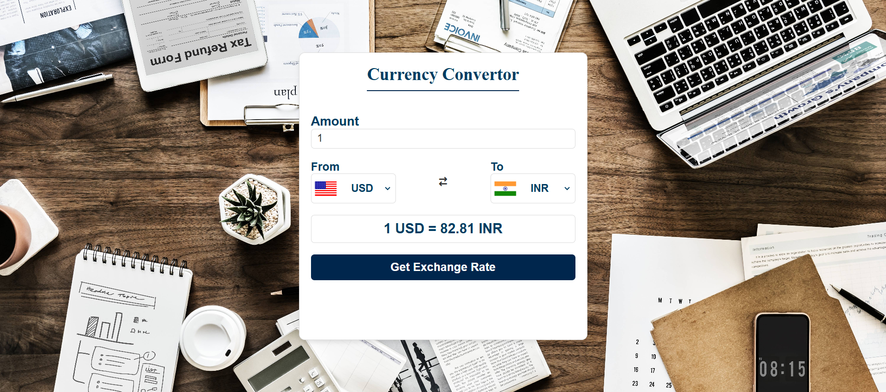

# Currency Converter Web App

The **Currency Converter** is a lightweight, front-end web application that allows users to convert currencies in real-time using a live exchange rate API. It features an interactive interface with country flags, a swap function, and input validation for smooth user experience.

### Features
- Convert between over 150 currencies using live exchange rates
- Swap “from” and “to” currencies easily
- Display country flags dynamically
- Real-time conversion results
- Responsive and visually appealing interface

### Tech Stack
- **Frontend:** HTML, CSS, JavaScript
- **API:** Fetch API for live exchange rates
- **Other:** Country flag API integration

### Project Structure
```
currency-converter/
├── index.html # Main HTML page
├── style.css # Styling
├── converter.js # JavaScript logic for conversions
├── country-code.js # Currency-country mapping
└── README.md # Project documentation
```

### Screenshots


